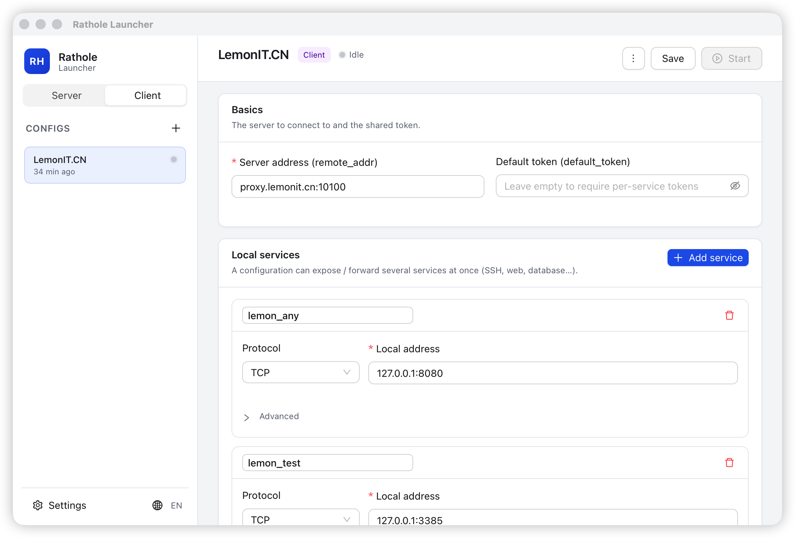

<div align="center">

# Rathole Launcher

让 [rathole](https://github.com/rathole-org/rathole) 反向代理隧道变得点几下就能搞定的桌面应用 — 同时支持 macOS、Windows 和 Linux。

[English](README.md) · **简体中文** · [日本語](README.ja.md) · [한국어](README.ko.md)

[](LICENSE)
[](../../releases)
[](https://tauri.app)
[](https://vuejs.org)
[](https://www.rust-lang.org)

[下载](../../releases) · [核心功能](#核心功能) · [快速开始](#快速开始) · [从源码构建](#从源码构建)

</div>

<p align="center">
  
</p>

---

## 为什么做这个

用过 rathole 的朋友大概都熟悉这一套流程:SSH 上服务器、改两份 TOML 文件、对照着复制 token、重启 daemon、tail 日志看运行情况、心里默默祈祷哪个字符没敲错。rathole 本身做得很出色 — 只是配置过程稍微琐碎了点。

Rathole Launcher 想做的就是把这套琐碎流程省掉。每个 rathole 选项都对应一个表单字段,token 可以从服务端配置自动同步过来,日志实时推送,启动 / 停止 / 重启都是一次点击。即使 launcher 自己崩了,正在跑的隧道也不会断,下次启动还能自动接管它们。

我们想做一个第一次接触 rathole 时希望就有的工具 — 顺便分享给你。

---

## 核心功能

### 🪟 完整覆盖 rathole 配置项的可视化编辑器

每一个文档里写到的选项都能通过表单填写:监听地址、token、心跳、重试、每个服务的覆盖参数,以及完整的传输层(TCP / TLS / Noise / WebSocket)和它们各自的子字段。高级设置默认折叠,简单需求保持简单。

### 🚀 启停、查看、重启 — 都在一个窗口里

每个编辑页顶部都有一条吸顶的控制栏,启动 / 停止 / 保存 / 重启按钮一直在视线内。日志实时滚动在下方,按来源(stdout / stderr / system)分色显示,每个实例最多保留 1000 行。配置在运行中被修改时,顶部会出现一条黄色提示,「立即重启」一键应用新配置。

### 🤖 自带 rathole — 也可以让我们去拿

启动时如果没有检测到 rathole 二进制,banner 会主动提示从 `rathole-org/rathole` 的 GitHub Release 自动下载,根据当前操作系统和 CPU 选择正确的包。Apple Silicon 在没有原生 ARM 包时会自动 fall back 到 Intel 版,通过 Rosetta 2 运行。每次启动还会顺便检查一下是否有新版,有就在同一个 banner 里提示。

### 📋 粘贴服务端 `server.toml`,自动生成客户端配置

侧边栏点 **+** → 切到「从服务端 TOML 导入」→ 粘上服务端的 server.toml → 点「解析」。服务名、token、传输层设置都会自动提取出来,你只需要为每个服务填上本地地址。配置完成。

### 🛟 自身崩溃也能优雅恢复

每个由 launcher 启动的 rathole PID 都会持久化到磁盘。即使 launcher 自己挂了 — 系统断电、OOM、误操作 `kill -9` — rathole 子进程仍然在跑(被 launchd / init / systemd 收养)。下次启动时 launcher 会自动检测这些孤儿进程并接管,你能继续控制它们。

### 🍴 三端常驻菜单栏 / 系统托盘

关闭主窗口不会退出应用,而是缩到 macOS 菜单栏 / Windows 系统托盘 / Linux StatusNotifier。从那里就能打开、启动、停止任意配置,一眼看到运行中的数量,或者真正退出 — 这时所有隧道都会被优雅地停掉。

### 🌍 中英日韩四语言

主界面**和**菜单栏菜单都翻译成了**简体中文、English、日本語、한국어**。首次启动时根据系统语言自动选择,跨次启动保留偏好,可以从左下角语言切换器随时切换,无需重启。

### 🤝 不打扰其他 rathole 实例

launcher 只管自己启动的进程,系统里其他人启动的 rathole 完全不动。「设置」页会列出所有检测到的 rathole 进程,清楚标明哪些是「launcher 管理」、哪些是「外部」。如果你试图启动一个端口被占用的服务端配置,launcher 会拒绝并明确告诉你哪些地址冲突了。

---

## 快速开始

### 1. 安装

每个 [GitHub Release](../../releases) 都附带预编译好的安装包:

| 平台 | 下载 | 安装 |
| --- | --- | --- |
| **macOS**(Apple Silicon / Intel) | `*.dmg` | 拖到「应用程序」,首次打开时右键 → **打开** |
| **Windows**(x64) | `*.msi` 或 `*-setup.exe` | 双击安装 |
| **Linux**(x64) | `*.AppImage` / `*.deb` / `*.rpm` | `chmod +x` 后运行,或用包管理器安装 |

包默认未签名,首次打开操作系统会弹「无法验证开发者」之类的提示 — 这是正常现象。如果你想跳过这一步,可以用自己的证书签名后再分发。

### 2. 准备 rathole 二进制

首次启动如果 launcher 旁边没有 `rathole`,会看到下面这条提示:

> **未检测到 rathole 可执行文件**
> 可从 GitHub 自动下载 rathole 0.5.0,或在「设置」中手动指定路径。
> &nbsp; &nbsp; **[ 自动下载 ]** &nbsp; **[ 去设置 ]**

点「自动下载」等几秒就行。如果你想用自己的版本,直接放到 launcher 同目录,或在「设置」里指向任意路径。

### 3. 创建配置

两条路,挑省事的那条走:

**手动录入** — 点侧边栏的 **+** 填表。每份配置保存为 `server_conf/` 或 `client_conf/` 下的 TOML 文件,放在 launcher 同目录,以后想手改或纳入版本管理都方便。

**从服务端 TOML 导入** *(客户端首选)* — 点 **+** → 切到「从服务端 TOML 导入」→ 粘上服务端配置 → 点「解析」。把每个服务对应到本地地址(比如 `127.0.0.1:22`),点「创建」。一份完整的客户端配置就生成好了。

### 4. 启动

点「启动」,日志开始滚动。一切正常的话一两秒内能看到 service 在服务端注册成功的日志。如果端口被占了或 token 错了一个字符,你会立刻知道,以及该去哪里改。

---

## 从源码构建

### 工具链要求

- **Node.js** ≥ 18
- **Rust** stable ≥ 1.77 — 用 [rustup](https://rustup.rs) 安装
- **Tauri 2 平台依赖** — 见[官方说明](https://tauri.app/start/prerequisites/)。macOS 需 Xcode CLT;Windows 需 MSVC 构建工具;Linux 需 GTK + WebKit2GTK 4.1 + libsoup-3 + libappindicator

### 开发

```sh
git clone https://github.com/<owner>/rathole-gui-launcher.git
cd rathole-gui-launcher
npm install
npm run tauri:dev
```

第一次会拉取大约 600 个 Rust crate,根据机器性能编译 5–15 分钟;之后就是增量编译,很快。

### 本地打包

`scripts/` 目录里有每个平台的一键打包脚本。脚本会自动检查工具链、安装依赖、跑 `tauri build`,最后打印产物路径。

| 平台 | 命令 |
| --- | --- |
| **macOS** | `./scripts/build-macos.sh` &nbsp; *(可选:`--silicon`、`--intel`、`--universal`)* |
| **Linux** | `./scripts/build-linux.sh` |
| **Windows** | `pwsh scripts/build-windows.ps1` |

### 通过 GitHub Actions 发版

`.github/workflows/release.yml` 在你 push 一个 `v*` tag 时,会并行构建 **macOS Apple Silicon、macOS Intel、Windows x64、Linux x64** 四套产物,自动挂到草稿 GitHub Release 上:

```sh
# 修改 src-tauri/tauri.conf.json 里的版本号、提交,然后:
git tag v0.1.0
git push origin v0.1.0
```

如果你设置了 `APPLE_CERTIFICATE`、`TAURI_SIGNING_PRIVATE_KEY` 等仓库 secret,会自动走代码签名;没设置的话产物是未签名版本,前期发布完全够用。

---

## 技术栈

| 层 | 选型 |
| --- | --- |
| 窗口框架 | [Tauri 2](https://tauri.app) |
| 前端 | [Vue 3](https://vuejs.org) `<script setup>`、[Vue Router](https://router.vuejs.org)、[Pinia](https://pinia.vuejs.org)、[Vue I18n](https://vue-i18n.intlify.dev) |
| UI 库 | [Antdv Next](https://github.com/antdv-next/antdv-next) — Ant Design Vue 的现代 Vue 3 重写 |
| 后端 | Rust + Tokio · [reqwest](https://crates.io/crates/reqwest)(rustls) · [sysinfo](https://crates.io/crates/sysinfo) · [zip](https://crates.io/crates/zip) · [toml](https://crates.io/crates/toml)(保留顺序) · [nix](https://crates.io/crates/nix) |
| 构建 | Vite、vue-tsc、tauri-cli |

---

## 参与贡献

非常欢迎 issue 和 PR。提交前几个小提示:

- 跑通上面的开发流程,Rust 用 `cargo fmt` 格式化,TypeScript / Vue 走默认的 Prettier 配置。
- 新加的 i18n 字段要在 `src/i18n/locales/` 下四份 locale 文件里同步,key 保持一致。
- 加新的 rathole 配置项? Rust 模型(`src-tauri/src/models/`)和 TS 类型(`src/types/rathole.ts`)要同时改。
- 大于一行的修复以外的改动,先开 issue 聊聊设计思路,我们很乐意一起讨论。

## 后续计划

我们正在思考的一些方向,欢迎认领:

- 深色模式
- 编辑页里每个 service 的运行状态指示
- 内置自签 TLS 证书生成器,方便局域网快速配置
- 可选的内嵌 `rathole` 二进制,完全离线分发

## 致谢

站在 [rathole](https://github.com/rathole-org/rathole) 这个出色项目的肩膀上,没有他们的工作就没有这个 launcher。

## 许可证

[MIT](LICENSE) — 随便 fork、发布、商用,在你的 release notes 里提一句就更好了,但不强制。
